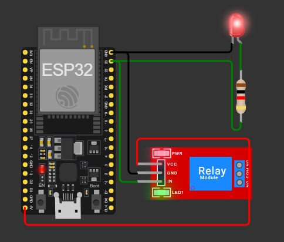
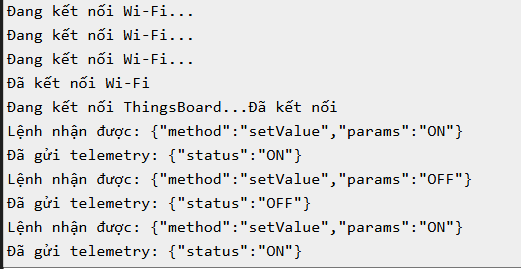
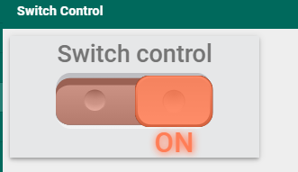

# Streetlight-Remote-Control-ThingsBoard-ESP32
Remotely control a streetlight using ESP32 and ThingsBoard via RPC with real-time ON/OFF switching from a dashboard.
Here's a sample README structure you can use:

---

## Requirements

- ESP32 or similar microcontroller
- ThingsBoard account
- Wi-Fi access
- Relay or LED for controlling the streetlight
- Basic knowledge of MQTT, ThingsBoard, and IoT devices

## Steps

### 1. Create a Switch Control Widget on Your Dashboard
In the ThingsBoard dashboard, create a widget to control the streetlight. This widget will send RPC commands to the ESP32 device.

### 2. Subscribe to the RPC Topic
On your device, subscribe to the `v1/devices/me/rpc/request/+` topic to receive commands from ThingsBoard.

### 3. Control the Streetlight Relay/LED
Upon receiving a command like:
```json
{"method":"setStatus","params":"ON"}
```
Control the streetlight's relay or LED accordingly. If the command contains `"params":"OFF"`, turn the light off.

### 4. Report the New Status Back
Once the status has changed, send telemetry data back to ThingsBoard so that the dashboard can reflect the current status of the light.

## Circuit Diagram



This circuit uses an ESP32, a relay (or LED), and necessary connections to control the streetlight.

## Terminal Output

Here’s an example of the terminal output when the system is running:



## Diagram



This diagram shows the integration of the ThingsBoard platform with the ESP32 device to control the streetlight remotely.
